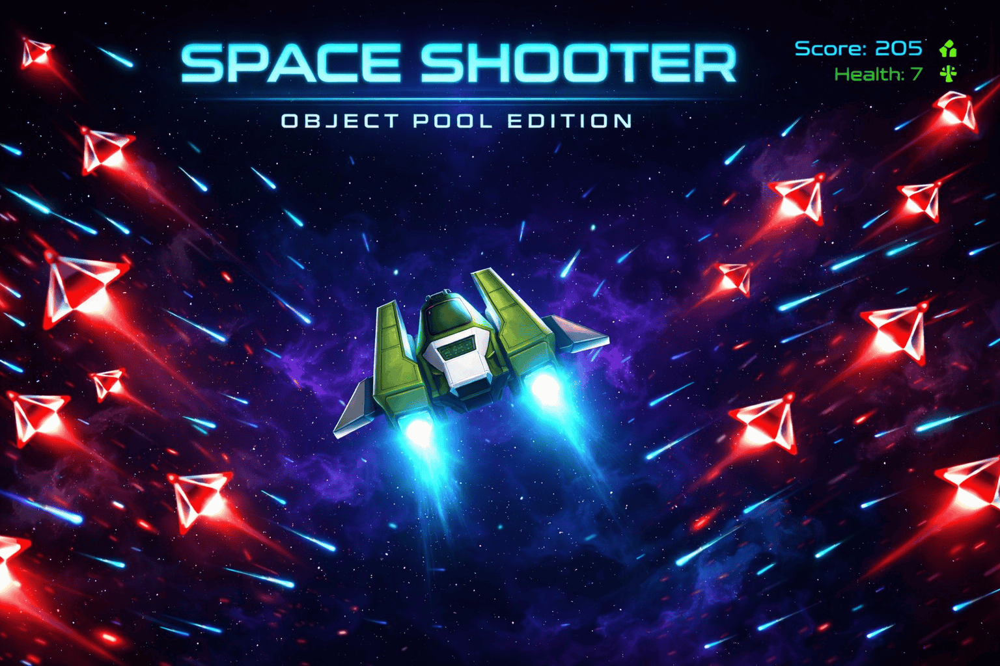
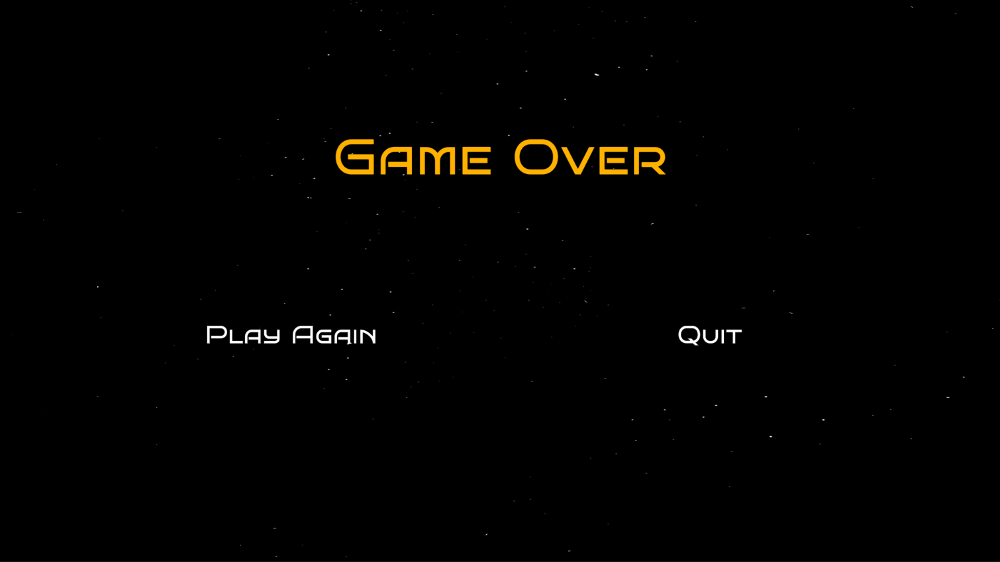
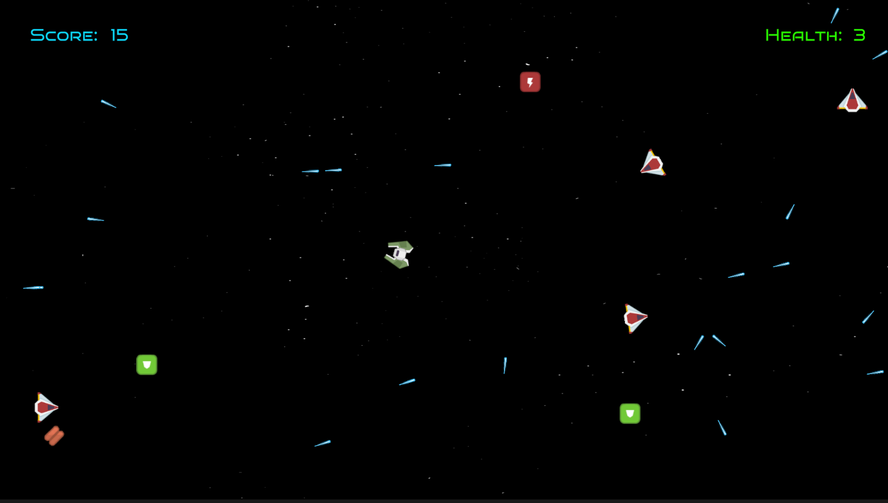

# Cosmic Curation: A Deep Dive into Scalable Unity Architecture

A classic 2D top-down space shooter built with a strong emphasis on clean, scalable, and maintainable code architecture. This project serves as a case study in applying professional software engineering patterns within the Unity engine.

<br>

<a href="https://youtu.be/14QMSW4gGsQ?si=kN-Fb8FLRT0PClde" title="Gameplay Video">
    
</a>

### [> Play the WebGL Build <](https://play.unity.com/en/games/b74e3bf8-ed8c-46db-bca3-659d24c4a510/space-shooter-object-pool)

<br>

## Gameplay




<br>

## Technical Deep Dive

Built in **Unity 2021.3.21f1**.

### The "Sweet Spot" Architecture
This project intentionally avoids both the monolithic "spaghetti code" of rapid prototypes and the over-engineered complexity of using unnecessary design patterns. The architecture is a pragmatic "sweet spot" that prioritizes:
- **Separation of Concerns:** Logic, data, and presentation are kept strictly separate.
- **Maintainability:** Components can be modified or replaced with minimal impact on the rest of the system.
- **Performance:** Key systems like object pooling are implemented to ensure smooth gameplay.

#### Architectural Pillars
1.  **MVC-like Structure (Model-View-Controller):**
    -   **Model (Data):** `ScriptableObjects` are used to define the stats and attributes of game entities (e.g., `PlayerScriptableObject`, `EnemyScriptableObject`). This decouples game balance and configuration from code.
    -   **View (Presentation):** "Dumb" `MonoBehaviour` classes that are only responsible for visual representation and forwarding Unity events (e.g., `PlayerView`, `EnemyView`). They hold no game logic.
    -   **Controller (Logic):** All game logic resides in pure C# classes (e.g., `PlayerController`, `EnemyController`). This makes the core logic independent of the Unity engine's scene hierarchy and easier to reason about.

2.  **Service Locator Pattern:**
    A central `GameService` acts as a composition root and service locator. It is responsible for initializing all services (e.g., `PlayerService`, `SoundService`) and injecting their dependencies, providing a single, controlled point of access for communication between systems.

<br>

## Key Implementations

### High-Performance Object Pooling
To avoid performance spikes from frequent `Instantiate()` and `Destroy()` calls, the project uses a robust object pooling system for bullets, enemies, and VFX. When an object is "destroyed," it is simply deactivated and returned to its pool, ready to be reused.

The logic finds an unused object in the pool, or creates a new one if the pool is exhausted.
```csharp
// Inside a pool class like EnemyPool.cs
public EnemyController GetEnemy()
{
    // Find an available object in the pool
    PooledEnemy enemy = pooledEnemies.Find(item => !item.isUsed);
    if (enemy != null)
    {
        enemy.isUsed = true;
        return enemy.Enemy;
    }
    // Or create a new one if none are available
    return CreateNewPooledEnemy();
}

public void ReturnEnemy(EnemyController enemy)
{
    // Return the object to the pool by marking it as not used
    PooledEnemy pooledEnemy = pooledEnemies.Find(e => e.Enemy.Equals(enemy));
    pooledEnemy.isUsed = false;
}
```

### Asynchronous Logic: Coroutines over `async`/`await`
Initially, `async`/`await` with `Task.Delay` was used for time-based logic like weapon fire rates. However, this proved problematic in WebGL builds and ignored Unity's `Time.timeScale` (breaking pause functionality).

The code was refactored to use Unity's native **Coroutines**, which are tightly integrated with the engine's game loop and provide reliable, platform-agnostic behavior.

```csharp
// PlayerController.cs - Refactored from async/await
private IEnumerator FireWeaponRoutine()
{
    currentShootingState = ShootingState.Firing;
    while (currentShootingState == ShootingState.Firing)
    {
        // ... fire logic ...

        // Use WaitForSeconds to respect game time and work on all platforms
        yield return new WaitForSeconds(currentRateOfFire);
    }
}
```

### OOP Principles in Action: The `IDamageable` Interface
To create a decoupled combat system, the `IDamageable` interface is used. This allows any entity (Player, Enemy) to be damaged without the bullet needing to know its specific type.

```csharp
// BulletController.cs
public void OnBulletEnteredTrigger(GameObject collidedGameObject)
{
    // The bullet doesn't care if it's a Player or an Enemy.
    // It only cares if the object is "Damageable".
    if (collidedGameObject.GetComponent<IDamageable>() != null)
    {
        collidedGameObject.GetComponent<IDamageable>().TakeDamage(bulletScriptableObject.damage);
        // ... return bullet to pool
    }
}
```

<br>

## System Architecture

### Class Diagram
The following diagram illustrates the relationships between the major systems in the project.
!Class Diagram

<br>

## Controls
- **Movement:** WASD Keys
- **Aim:** Mouse Cursor
- **Shoot:** Space Bar